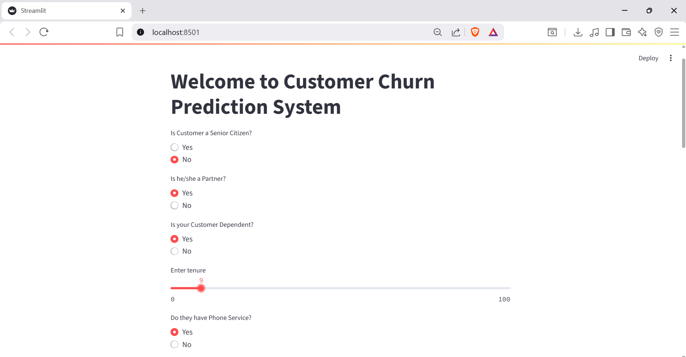
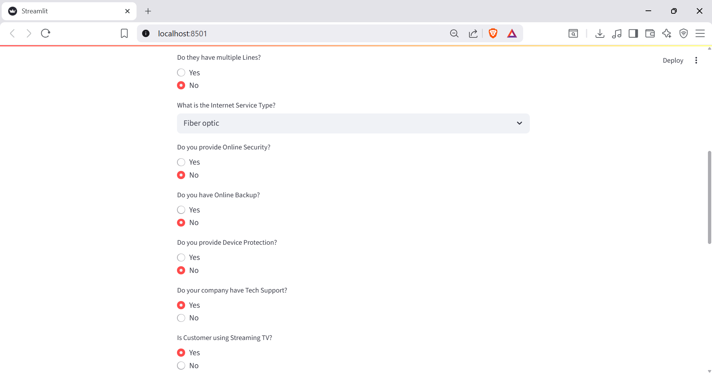
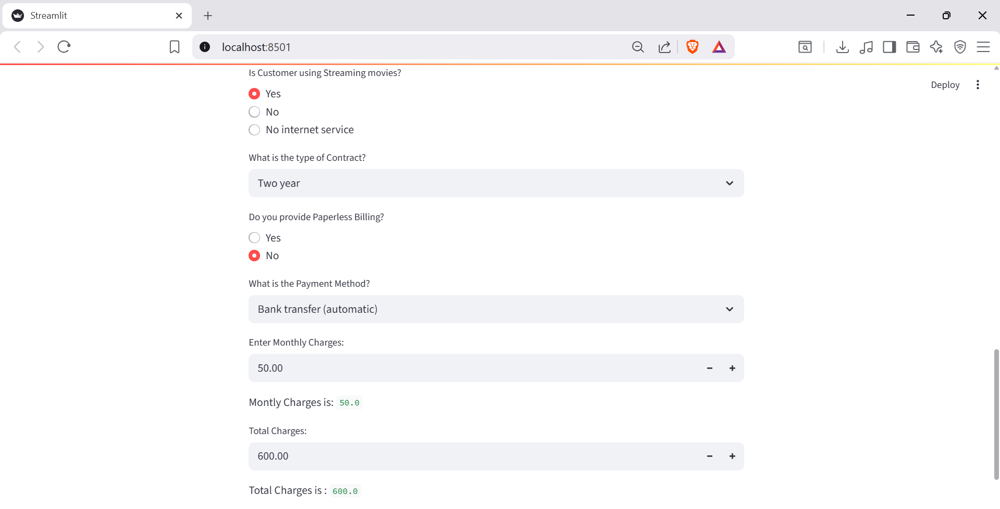

# Taxi Price Estimator 

This project predicts whether a customer will churn (i.e., stop using a service) using a **Gradient Boosting** machine learning model. The project includes a **Streamlit-based UI** that allows users to input customer details and get a churn prediction in real-time.

---

## Table of Contents

- [Installation](#installation)  
- [Dataset](#dataset)  
- [Features](#features)  
- [Usage](#usage)  
- [Model](#model)  
- [License](#license) 

---

## Screenshot






---

## Installation
1. Clone the repository:

```bash
git clone https://github.com/Aaryan012/Customer-Churn-Prediction.git
cd Churn-Prediction
```
---
## Columns / Features

customerID

gender

SeniorCitizen

Partner

Dependents

tenure

PhoneService

MultipleLines

InternetService

OnlineSecurity

OnlineBackup

DeviceProtection

TechSupport

StreamingTV

StreamingMovies

Contract

PaperlessBilling

PaymentMethod

MonthlyCharges

TotalCharges

Churn (Target)
---
## Usage

Launch the Streamlit app:

streamlit run app.py


The UI will open in your browser. Fill in the customer details and click Predict to see the churn prediction.

Example prediction input includes fields such as: gender, SeniorCitizen, Partner, Dependents, tenure, PhoneService, etc.

## Model

Algorithm: Gradient Boosting Classifier

Trained on customer features to predict churn (Yes/No).

The model is saved in model.pkl and loaded by the Streamlit app for real-time predictions.

## License

This project is licensed under the MIT License.